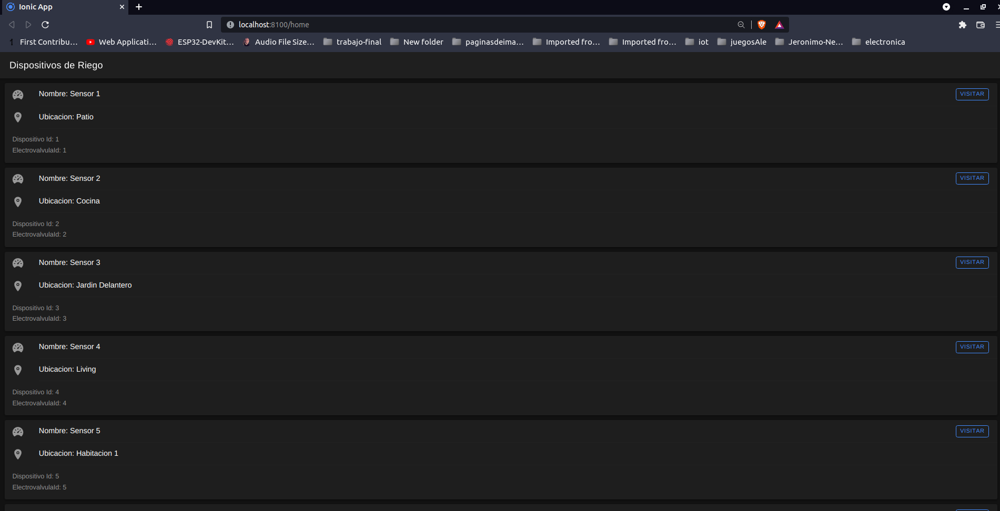
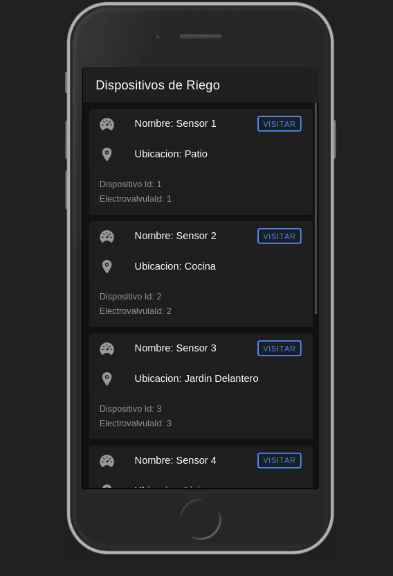
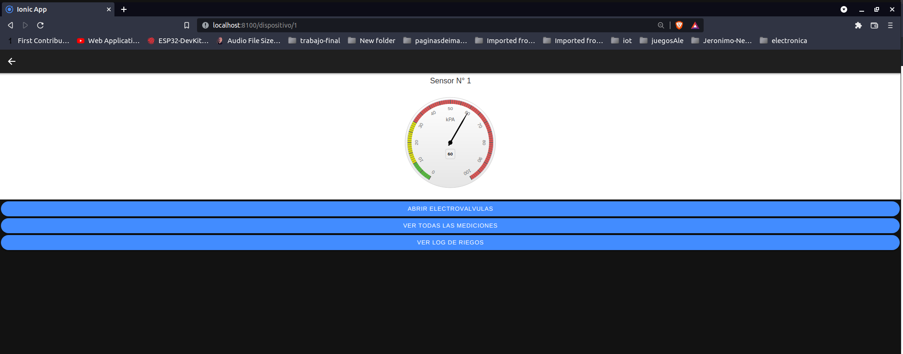
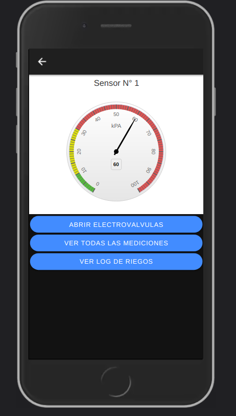
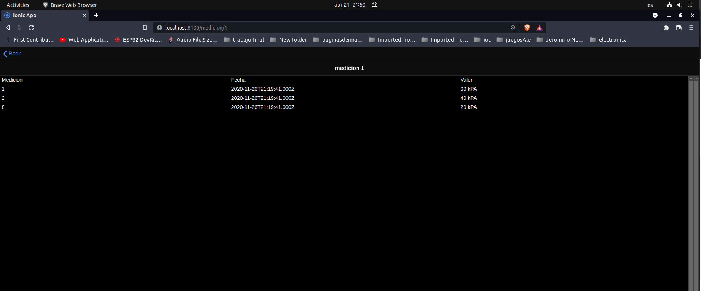
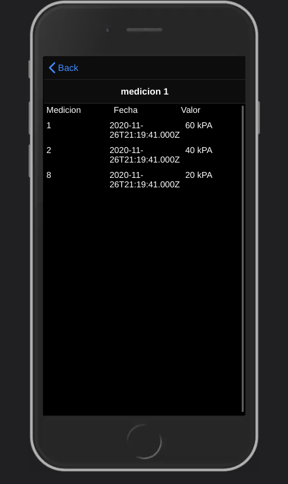
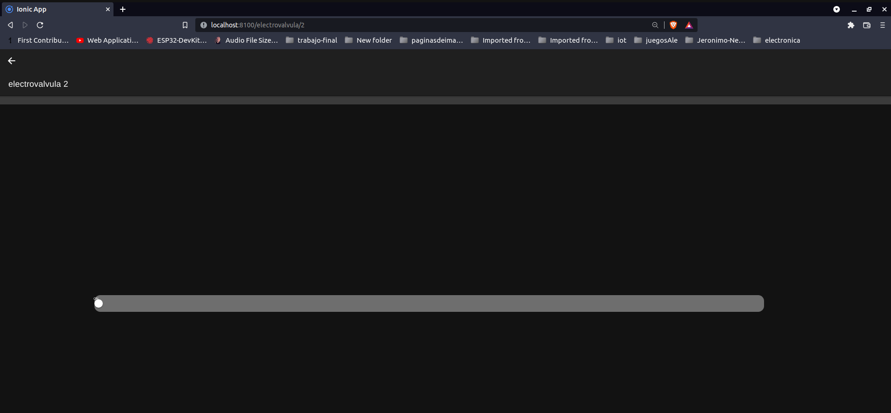
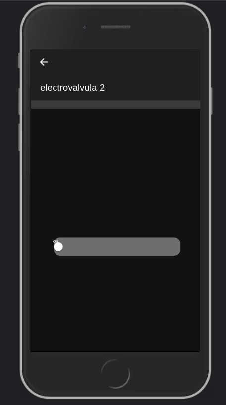
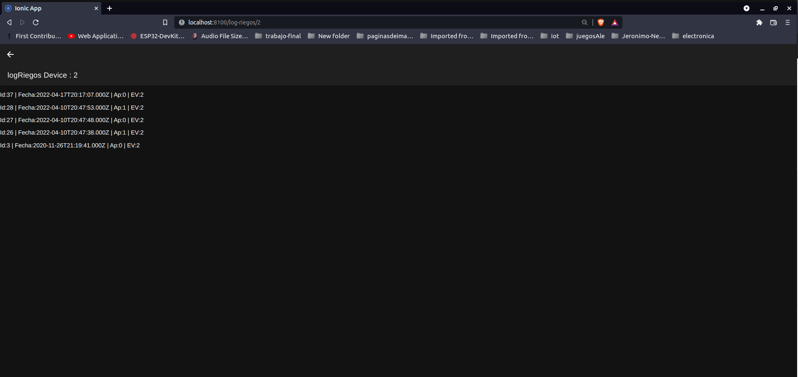
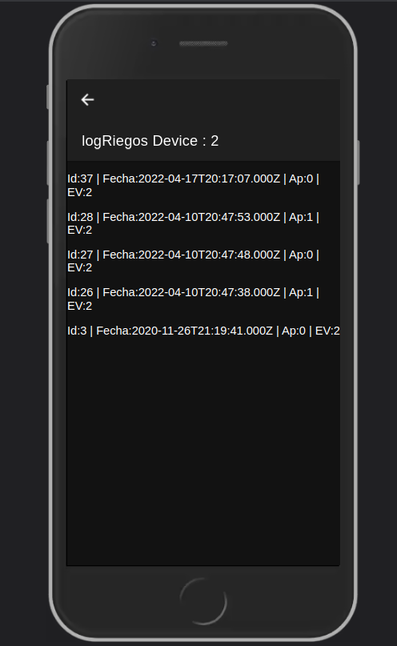

# TPDAM-Front
Ionic Frontend para sistema de Riego Automatizado

Se utiliza con el sistema backend generado en el repositorio TPDAM, que se puede descargar desde ("https://github.com/gustavobastian/TPDAM").

## Pasos para que correr la aplicación:

Dentro de la carpeta del proyecto ejecutar:\
\
 `npm install`\
 \
Luego de que se instalaron las dependencias (y se tiene ejecutando el servidor backend con la base de datos):\
\
`ionic serve`

## Descripción de la aplicación:
### Modelos de datos:
Utilizo cuatro clases principales:
* dispositivo: Guarda nombre, ubicación, identificacion y nro de electrovalvula del dispositivo.
* electrovalvula: guarda estado e identificación de electrovalvula
* logRiegos: guarda informacion de apertura, fecha de modificación, nro de electrovalvula activada e identificación del log. 
* medicion: guarda fecha, valor del sensor, nro de dispositivo y nro de medición.

Los mismos poseen correlación con las entidades de la base de datos del backend.

### Servicios:
Para cada modelo de datos poseo un servicio:
* dispositivo: posee una peticion getListadoDispositivos() del listado de todos los dispositivos al server, y una peticion getDispositivo(id) especificando el id del mismo para obtener información de un dispositivo en singular. 
* mediciones: peticion getAllMedicion() de todas las mediciones de la base de datos. Peticion getLastMedicion(id) de un dispositivo en singular... se utiliza para actualizar la información del visor de sensor. También hay una funcion Post saveLastMedicion(Medicion) que permite guardar la ultima información de una medición.
* log-riego: Peticion getLogRiegos(id) permite obtener todos los log de riego de un dispositivo dado. Peticion getLastLogRiegos(id) permite obtener el último log de un dispositivo, se utiliza para actualizar el estado actual de la electroválvula(en la página electrovalvula).
* electrovalvula: getElectrovalvula(id) permite obtener información de una electrovalvula particular. Put modifyValveState(id) permite modificar el estado actual de la electrovalvula escribiendo en la base de datos. Funcion getLastMedicion(id): solicita al backend la información de la ultima medicion del sensor asociado a la electrovalvula id.

## Pipes: 
La aplicación posee 2 pipes, uno para dar formato al log de riegos y uno para las mediciones(este último no utilizado finalmente)

## Directiva custom:
La aplicación posee una sola directiva custom llamada myDirective...que no funciona correctamente(se utiliza en la página de Mediciones).
## Paginas:
La aplicación posee 5 páginas que se visualizan a continuación(Utilicé modo dark en el browser para generarlas).

 ### Vistas de las Aplicación

#### Pagina principal
Lista todos los dispositivos.

##### Vista Browser

##### Vista Celular

#### Pagina Sensor
##### Vista Browser

##### Vista Celular

#### Pagina Mediciones
##### Vista Browser

##### Vista Celular

#### Pagina Electroválvula
##### Vista Browser

##### Vista Celular

#### Pagina Log Riegos
##### Vista Browser

##### Vista Celular
